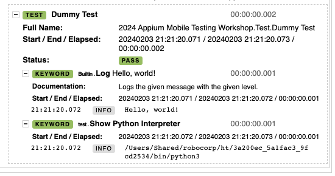

# Appium RCC setup

This is an alternative way to install the environment required for the "Mobile application testing" workshop at Robocon 2024. 

It replaces the steps 1-3 in [their setup instructions](https://github.com/eficode-academy/rf-mobile-testing-appium/blob/main/README.md). **All other steps must still be done after their instructions.**

Disclaimer: 
This was developed on a Macbook Pro M1. Use at your own risk. ⚠️ 

## Step 0: Get RCC

Download RCC from [here](https://downloads.robocorp.com/rcc/releases/index.html) and save it in a folder which is in `$PATH`.

## Step 1: Environment creation

`cd` into this folder and start the environment creation (all dependencies are read from `conda.yaml`):

```bash
# install RCC environment
      rcc task shell
```

As soon as the creation has been finished, you are in a bash "inside" the RCC environment. Run the install script to install the rest of the software: 

```
bash-5.1$ ./install
```

The installation report at the end will display the path to the Python interpreter inside the environment. Copy this to the clipboard: 

```bash
=== INSTALLATION REPORT ===
🟢 Installation complete.
Python executable: /Users/Shared/robocorp/ht/3a200ec_5a1fac3_9fcd2534/bin/python3   <-- use this as Python interpreter in VS Code
Python version: Python 3.10.12
Java executable: /Users/simon/Documents/01_Development/04_Workshop-Code/2024_robocon/2024_appium_mobile_testing_workshop/lib/jdk8/bin/java
Java version: openjdk version "1.8.0_392"
Android SDK cmdline tools dir: /Users/simon/Library/Android/sdk/cmdline-tools/latest/bin
Android SDK emulator dir: /Users/simon/Library/Android/sdk/emulator
Android SDK platform-tools dir: /Users/simon/Library/Android/sdk/platform-tools
```

## Step 2: VS Code

(It is recommended to install the [RobotCode Extension](https://github.com/d-biehl/robotcode) in VS Code.)

Inside of VS Code:
- press `Cmd-Shift-P` 
- -> *Python: Select Interpreter* 
- -> *Enter Interpreter path...*
- paste the copied path here. 

Open `test.robot` and run it. The log.html should show the Python interpreter inside of RCC: 



